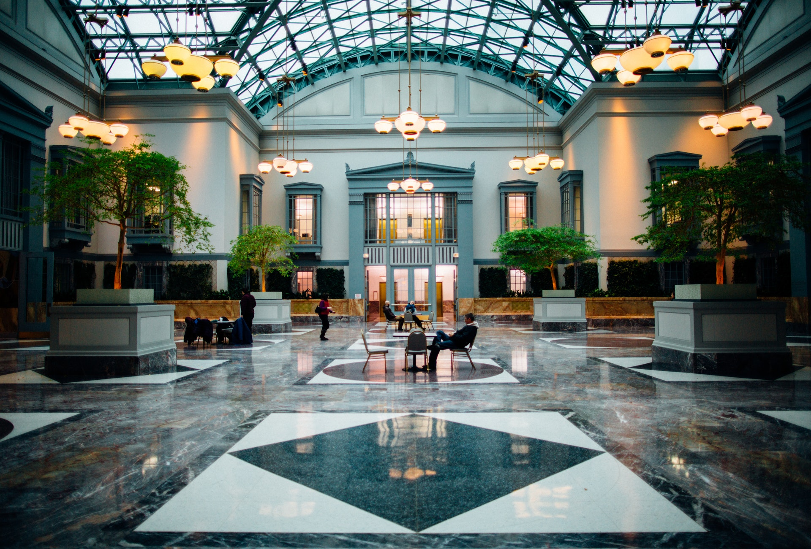

<div align="center">

# 🏨 Deluxe Hotel Website

A responsive hotel website built with **HTML** and **CSS**.


</div>

---

## 📌 Project Links

- 🔗 **GitHub Repository:** [Deluxe Hotel Website](https://github.com/muratEfeErgin/Hotel--Site)
- 🌐 **Live Demo:** https://muratefeergin.github.io/Hotel--Site/

---

## 📸 Preview

> You can replace this image with a screenshot of your website later.



---

## 📖 About The Project

**Deluxe Hotel Website** is a responsive hotel landing page created with only **HTML** and **CSS**.

This project was developed as a practice project to improve:

- Semantic HTML structure
- CSS styling
- Flexbox layout
- Responsive design
- Multi-page website organization
- Basic UI design skills

The project includes a home page and a blog page. It does not use JavaScript or Bootstrap in this version.

---

## 🚀 Project Status

The project is mostly completed.

### Current Sections

| Section                  | Status       |
| ------------------------ | ------------ |
| Home Page                | ✅ Completed |
| Blog Page                | ✅ Completed |
| Fixed Navbar             | ✅ Completed |
| Hero Section             | ✅ Completed |
| Services Section         | ✅ Completed |
| Gallery Section          | ✅ Completed |
| Rooms Section            | ✅ Completed |
| Team / Personnel Section | ✅ Completed |
| Contact Section          | ✅ Completed |
| Footer                   | ✅ Completed |
| Responsive Design        | ✅ Completed |

---

## 🛠️ Technologies Used

| Technology    | Purpose           |
| ------------- | ----------------- |
| HTML5         | Page structure    |
| CSS3          | Styling           |
| Flexbox       | Layout system     |
| Media Queries | Responsive design |
| Font Awesome  | Icons             |
| Google Fonts  | Typography        |

---

## 📄 Pages

### 🏠 Home Page

The home page includes the main hotel landing page sections:

- Header and navigation bar
- Welcome hero area
- Service cards
- Customer service section
- Image gallery
- Room cards
- Personnel / team section
- Contact form
- Footer

### 📰 Blog Page

The blog page includes:

- Blog page header
- Blog cards
- Blog images
- Blog titles
- Short descriptions
- Read more buttons

---

## ✨ Features

- 📱 Responsive layout for mobile and desktop screens
- 🧱 Mobile-first CSS structure
- 🎯 Flexbox-based section layouts
- 🌄 Background image with dark gradient overlay
- 📌 Fixed navigation bar
- 🧭 Smooth scroll behavior
- 🎨 CSS variables for color management
- 🖱️ Hover effects on buttons, images, and navigation links
- 📁 Separate responsive stylesheet
- 📰 Separate blog page

---

## 📁 Project Structure

```text
Hotel-Site/
│
├── index.html
├── blogs.html
├── style.css
├── responsive.css
│
└── img/
    ├── bg-1.jpeg
    ├── bg-2.jpeg
    ├── about1.jpeg
    ├── about2.jpeg
    ├── contact.jpeg
    ├── room1.jpeg
    ├── room2.jpeg
    ├── room3.jpeg
    ├── blog-1.jpeg
    ├── blog-2.jpeg
    ├── blog-3.jpeg
    ├── blog-4.jpeg
    └── gallery images
```

---

## 🎯 What I Practiced

In this project, I practiced:

- Creating a full website layout with semantic HTML
- Using `header`, `nav`, `main`, `section`, and `footer`
- Styling a website with CSS variables
- Creating responsive designs with media queries
- Using Flexbox for alignment and layout
- Adding background images and gradient overlays
- Creating a simple multi-page website
- Organizing CSS files
- Building a cleaner project structure

---

## 📌 Notes

This project was created while learning **HTML** and **CSS**.

JavaScript and Bootstrap were not used in this version.  
They may be added in future projects after improving the core HTML and CSS skills.

---

<br>

<div align="center">

# 🇹🇷 Deluxe Hotel Web Sitesi

**HTML** ve **CSS** ile hazırlanmış responsive otel web sitesi.


</div>

---

## 📌 Proje Linkleri

- 🔗 **GitHub Repository:** [Deluxe Hotel Website](https://github.com/muratEfeErgin/Hotel--Site)
- 🌐 **Canlı Demo:** https://muratefeergin.github.io/Hotel--Site/

---

## 📸 Ön İzleme

> Daha sonra buraya sitenin ekran görüntüsünü ekleyebilirsin.


---

## 📖 Proje Hakkında

**Deluxe Hotel Website**, sadece **HTML** ve **CSS** kullanılarak hazırlanmış responsive bir otel web sitesidir.

Bu proje şu konularda pratik yapmak için geliştirilmiştir:

- Semantik HTML yapısı
- CSS ile tasarım
- Flexbox kullanımı
- Responsive tasarım
- Çok sayfalı site yapısı
- Temel arayüz tasarımı

Bu sürümde JavaScript veya Bootstrap kullanılmamıştır.

---

## 🚀 Proje Durumu

Proje büyük ölçüde tamamlanmıştır.

### Mevcut Bölümler

| Bölüm                  | Durum         |
| ---------------------- | ------------- |
| Ana Sayfa              | ✅ Tamamlandı |
| Blog Sayfası           | ✅ Tamamlandı |
| Sabit Navbar           | ✅ Tamamlandı |
| Hero Alanı             | ✅ Tamamlandı |
| Hizmetler Bölümü       | ✅ Tamamlandı |
| Galeri Bölümü          | ✅ Tamamlandı |
| Odalar Bölümü          | ✅ Tamamlandı |
| Personel / Ekip Bölümü | ✅ Tamamlandı |
| İletişim Bölümü        | ✅ Tamamlandı |
| Footer                 | ✅ Tamamlandı |
| Responsive Tasarım     | ✅ Tamamlandı |

---

## 🛠️ Kullanılan Teknolojiler

| Teknoloji     | Kullanım Amacı     |
| ------------- | ------------------ |
| HTML5         | Sayfa yapısı       |
| CSS3          | Tasarım            |
| Flexbox       | Sayfa düzeni       |
| Media Queries | Responsive tasarım |
| Font Awesome  | İkonlar            |
| Google Fonts  | Yazı tipi          |

---

## 📄 Sayfalar

### 🏠 Ana Sayfa

Ana sayfada otel sitesi için gerekli temel bölümler bulunmaktadır:

- Header ve navbar
- Karşılama hero alanı
- Hizmet kartları
- Customer service bölümü
- Görsel galeri
- Oda kartları
- Personel / ekip bölümü
- İletişim formu
- Footer

### 📰 Blog Sayfası

Blog sayfasında şu alanlar bulunmaktadır:

- Blog header alanı
- Blog kartları
- Blog görselleri
- Blog başlıkları
- Kısa açıklamalar
- Read more butonları

---

## ✨ Özellikler

- 📱 Mobil ve masaüstü ekranlara uyumlu responsive yapı
- 🧱 Mobile-first CSS yaklaşımı
- 🎯 Flexbox ile oluşturulmuş düzenler
- 🌄 Arka plan görseli üzerine gradient karartma efekti
- 📌 Sabit navbar
- 🧭 Smooth scroll özelliği
- 🎨 Renk yönetimi için CSS değişkenleri
- 🖱️ Buton, görsel ve navbar linklerinde hover efektleri
- 📁 Ayrı responsive CSS dosyası
- 📰 Ayrı blog sayfası

---

## 📁 Proje Dosya Yapısı

```text
Hotel-Site/
│
├── index.html
├── blogs.html
├── style.css
├── responsive.css
│
└── img/
    ├── bg-1.jpeg
    ├── bg-2.jpeg
    ├── about1.jpeg
    ├── about2.jpeg
    ├── contact.jpeg
    ├── room1.jpeg
    ├── room2.jpeg
    ├── room3.jpeg
    ├── blog-1.jpeg
    ├── blog-2.jpeg
    ├── blog-3.jpeg
    ├── blog-4.jpeg
    └── galeri görselleri
```

---

## 🎯 Bu Projede Neler Çalışıldı?

Bu projede şu konularda pratik yapıldı:

- Semantik HTML ile sayfa yapısı oluşturma
- `header`, `nav`, `main`, `section` ve `footer` etiketlerini kullanma
- CSS değişkenleri ile renk yönetimi yapma
- Media query ile responsive tasarım oluşturma
- Flexbox ile hizalama ve düzen kurma
- Background image ve gradient overlay kullanma
- Basit çok sayfalı web sitesi oluşturma
- CSS dosyalarını düzenli şekilde ayırma
- Daha temiz proje yapısı oluşturma

---

## 📌 Notlar

Bu proje **HTML** ve **CSS** öğrenme sürecinde hazırlanmıştır.

Bu sürümde JavaScript ve Bootstrap kullanılmamıştır.  
Temel HTML ve CSS becerileri geliştirildikten sonra gelecek projelerde Bootstrap ve JavaScript eklenebilir.

---

<div align="center">

⭐ If you like this project, you can give it a star on GitHub.

</div>
